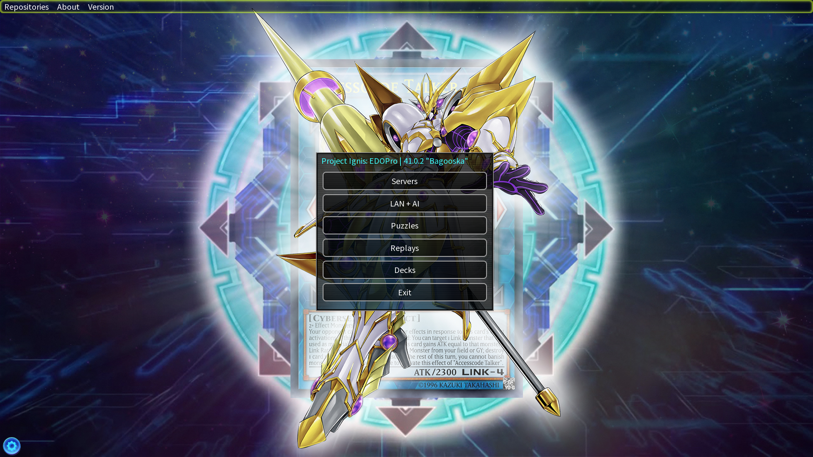
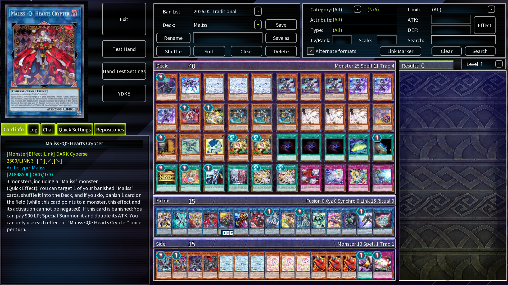
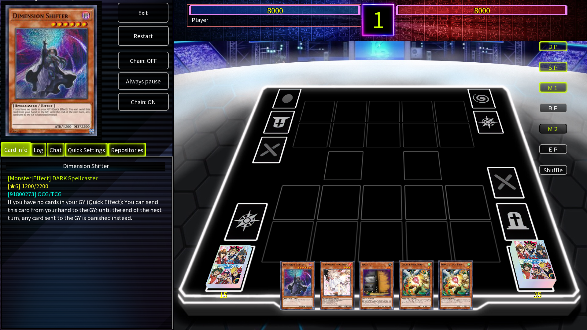
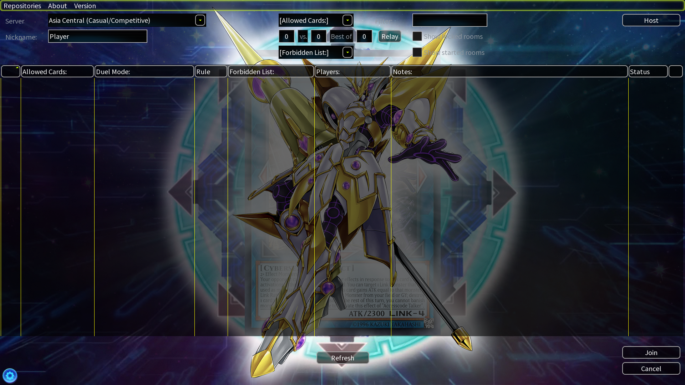

# GogettoPro

  
  
  
  

_A modern skin for EDOPro._

---

## 📥 Installation

> [!NOTE]
> Don't have EDOPro yet? Grab it here: **<https://projectignis.github.io/download.html>**

1. Download **`GogettoPro.exe`** from the **[Releases](../../releases)** page
2. Open it and press **Extract**. The destination is already filled in as **`C:\ProjectIgnis\skin`** (change it if you installed **EDOPro** somewhere else)
3. Launch **EDOPro** → **Settings** → set **Skin** to **GogettoPro** → press **Reload skin**

> [!TIP]
> Looking for decks? Thousands of **`.ydk`** files are available here: **<https://ygoprodeck.com>**

## 🧩 Recommended Add-ons

| Add-on                                                                                               | Author                                  |
| ---------------------------------------------------------------------------------------------------- | --------------------------------------- |
| [HD Card Pack](https://drive.google.com/drive/folders/19hDyCRRXOk1DdjTVjaGnd5avgt5myxNO?usp=sharing) | Fudo Yusei _(EDOPro HD Facebook Group)_ |
| [EDOPRO Soundpack](https://github.com/Lahrenheit/EDOPRO-Soundpack)                                   | Lahrenheit                              |

## ©️ Credits

This skin builds on textures and artwork from these talented creators:

| Resource                                                                                                                                     | Author          |
| -------------------------------------------------------------------------------------------------------------------------------------------- | --------------- |
| [EDOPRO Skinpack](https://github.com/Lahrenheit/EDOPRO-Skinpack)                                                                             | Lahrenheit      |
| [Accesscode Talker Wallpaper](https://www.deviantart.com/nhociory/art/Accesscode-Talker-906655770)                                           | nhociory        |
| [Remote Duel Tournament Prize Sleeve](https://www.deviantart.com/youssef-mamdouh/art/Remote-Duel-Tournament-Prize-Sleeve-957229959)          | Youssef-Mamdouh |
| [The Dark Side of Dimensions Hologram Cardback](https://www.reddit.com/r/yugioh/comments/irw1gb/recreated_kaibas_hologram_cards_with_my_own) | FlynnKrojak     |
| [World Championship Banner](https://www.yugioh-card.com/eu/wp-content/uploads/2022/09/WCS-hero-banner.webp)                                  | Konami          |

_All credit for the original artwork goes to their respective creators. This is only a non-commercial fan project._
